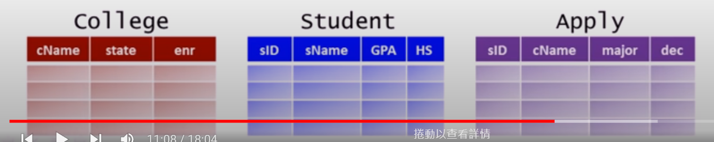
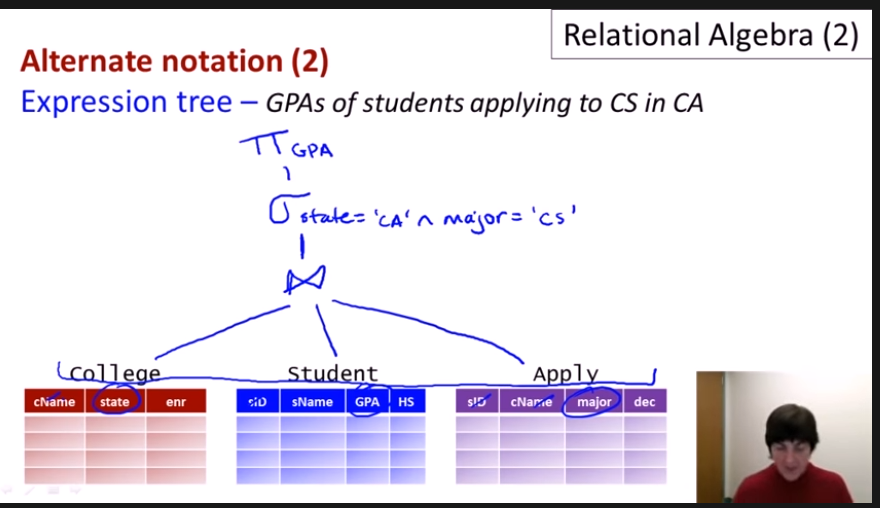

[TOC]
# 1 Relational Algebra
In all, relational Algebra is a mathematical tool used to clarify our data query process.

## 1.1 Select Operator
pick certain rows from a relation.
For example
1. Student with GPA > 3.7
$$\sigma_{GPA > 3.7} Student$$

2. Student with GPA > 3.7 and HS < 1000
$$\sigma_{GPA > 3.7} \wedge HS <1000 Student$$ 

3. Applications to Stanford CS major
$$\sigma_{(Name='Stanford'\wedge major='cs')} Apply$$

## 1.2 Project Operator
pick certain columns
For example
1. ID and decision of all applications
$$\pi_{(sID,dec)} Apply$$

Combine them together, we can pick both rows and columns.

For example, ID and name of students with GPA > 3.7

$$\pi_{sID,name}(\sigma_{GPA>3.7}Student)$$

## 1.3 Duplicates
For example, list of application majors and decisions.

$$\pi_{major,dec} Apply$$
SQL: multisets do not drop duplicates
R.A.: sets drop duplicates

## 1.4 Cross-product
Cartesian product 笛卡尔直积
For example

$$Student \times Apply$$


Names and GPAs of students with HS > 1000 who applied to CS and were rejected.



$$\pi_{sName,GPA}(\sigma_{Student.sID=Apply.sID \wedge HS > 1000 \wedge major='CS' \wedge dec = 'Reject'}(Student \times Apply))$$

We first write this query with a big table $Student \times Apply$ to contain all the information, and then gradually expand it with select operator and porject operator.


## 1.5 Natural Join
* Enforce equility on all attributes with same equility
* Eliminate one copy of duplicate attributes

就是一个内连接和一个外连接的区别

So for the same question, withour forced equility
\bowtie
$$\pi_{sName,GPA}(\sigma_{ HS > 1000 \wedge major='CS' \wedge dec = 'Reject'}(Student \bowtie Apply))$$

Names and GPAs of students with HS > 1000 who applied to CS at college with enr > 20000 and were rejected.

$$\pi_{sName,GPA}(\sigma_{ HS > 1000 \wedge major='CS' \wedge dec = 'Reject' \wedge enr > 20000}(Student \bowtie Apply \bowtie College))$$

## 1.6 Theta Join
Here theta is a condition
* Basic operation implemented in DBMS
* Term join often means theta join


$$Exp_1, \bowtie_{\theta},Exp_2 = \sigma_{\theta}(Exp_1,Exp_2)$$

## 1.7 Union Operator
List of college and student names

$$
\pi_{cName}College \cup \pi_{sName} Student
$$

## 1.8 Difference Operator
IDs of students who didn't apply anywhere

$$
\pi_{sID} Student - \pi_{sID} Apply
$$

IDs and Names of students who didn't apply anywhere

$$
\pi_{sName}((\pi_{sID} Student - \pi_{sID} Apply) \bowtie Student)
$$


## 1.9 Intersection Operator
Names that are both a college name and a student name

$$
    \pi_{sName}Student \cap \pi_{cName}Apply
$$


## 1.10 Rename Operator

Reassain schema in E
$$
    \rho_{R(A_1,...,A_n)}(E)
$$
Change Relational name
$$
    \rho_{R}(E)
$$

Change Attribute name
$$
    \rho_{A_1,...,A_n}(E)
$$

To unify schemas for set operators

List of college and student names

$$
    \rho_{c(name)}(\pi_{sName}Student) \cap \rho_{c(name)}(\pi_{cName}Apply)
$$


For disambiguation in "self-joins"
For example, pairs of colleges in same state

$$
    \sigma_{s1=s2}(\rho_{c1(n1,s1,e1)}(College) \times \rho_{c2(n2,s2,e2)}(College))
$$


$$
    \sigma_{n1\neq n2}(\rho_{c1(n1,s,e1)}(College) \bowtie \rho_{c2(n2,s,e2)}(College))
$$

less than !!! nb!
$$
    \sigma_{n1\lt n2}(\rho_{c1(n1,s,e1)}(College) \bowtie \rho_{c2(n2,s,e2)}(College))
$$

$$
    C1:=\rho_{c1(n1,s,e1)}(College)\\
    C2:=\rho_{c2(n2,s,e2)}(College)\\
    CP:=C1 \bowtie C2\\
    Ans:=\sigma_{n1 \lt n2} CP
$$

## 1.11 Expression Trees

GPAs of students applying to CS in CA





--------------------------------


# 2 SQL intro
Data Definition Language (DDL)
* create table
* drop table

Data Manipulation Language (DML)
* select 
* insert
* delete
* update


```sql
Select A1,A2,...An
From R1,R2,...,Rm
Where condition
```
It is equal to:
$$
    \pi_{A1,...,An}(\sigma_{condition}(R1\times...\times Rm))
$$


# 3 select statement

data relations:
> 1. College(<u>c_name</u>,state,enrollment)
> 2. Student(<u>sID</u>,sName,GPA,sizeHS)
> 3. Apply(<u>sID</u>,<u>cName</u>,<u>major</u>,decision)